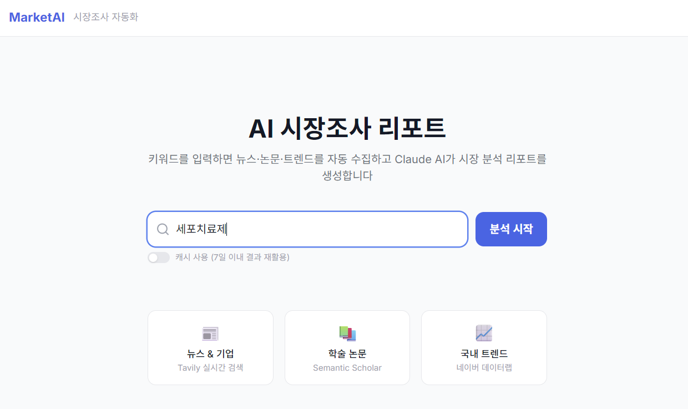
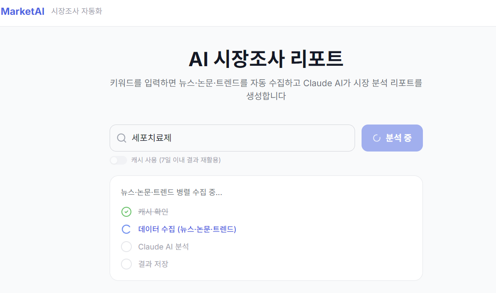
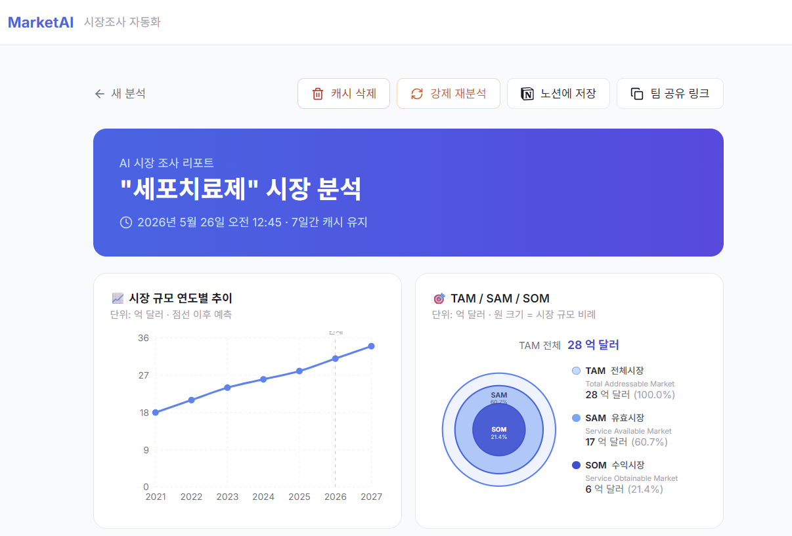
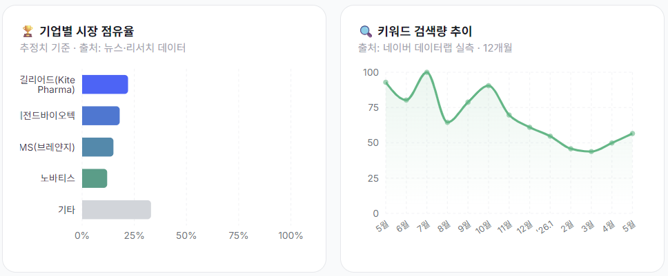
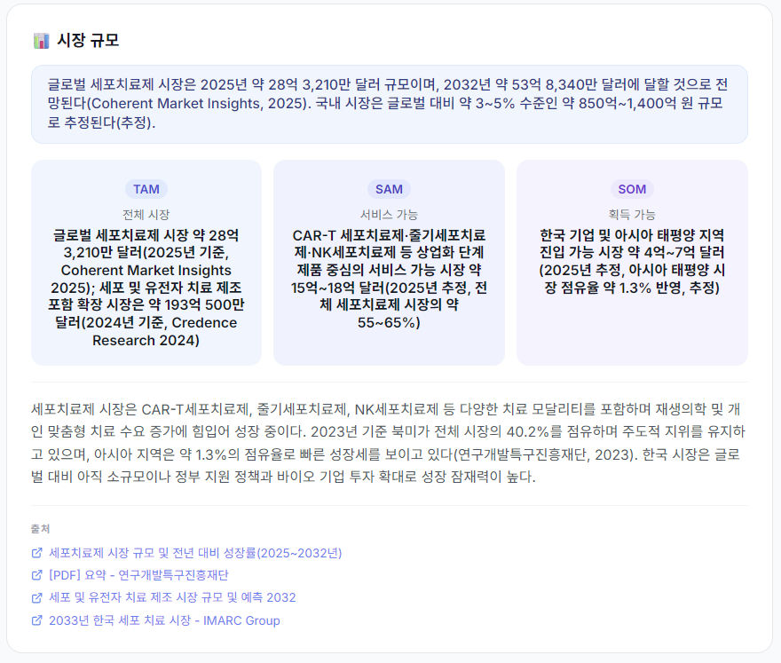
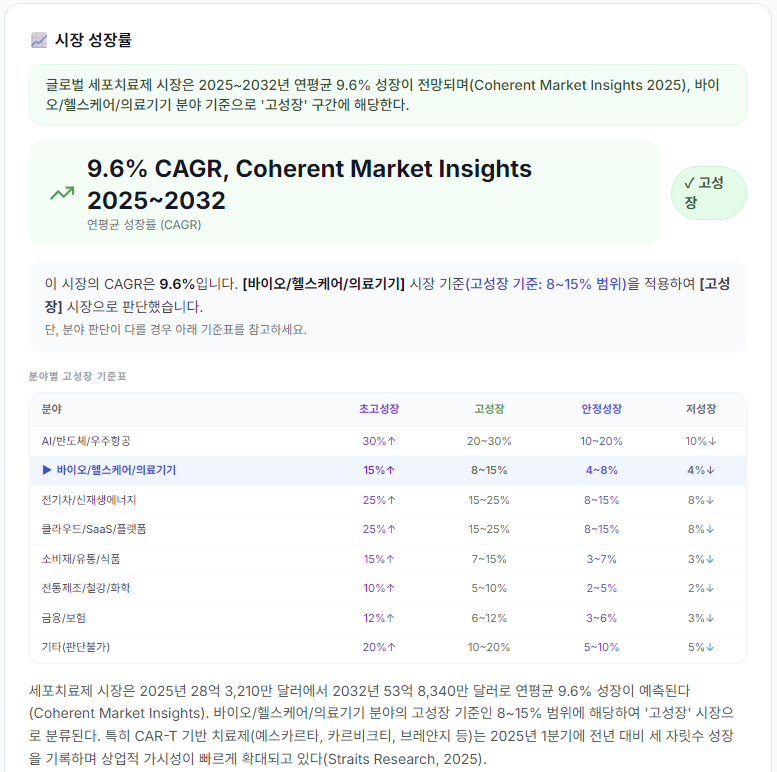
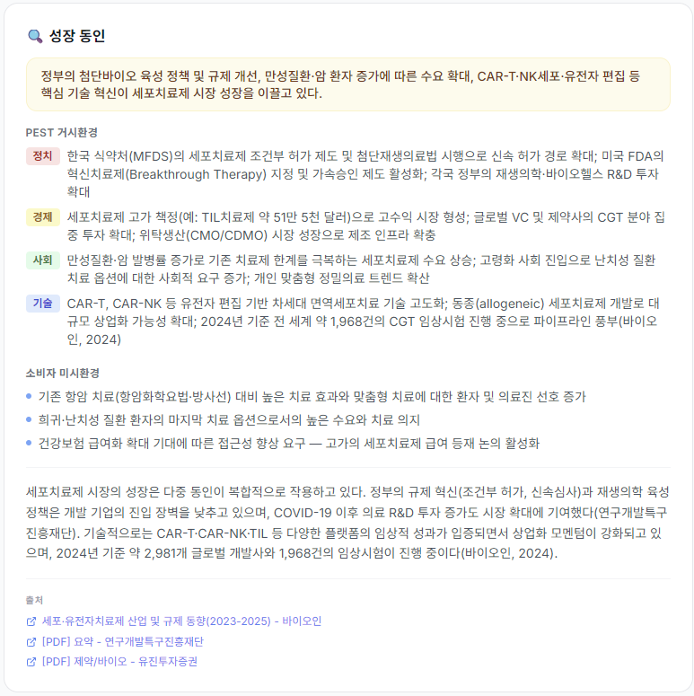
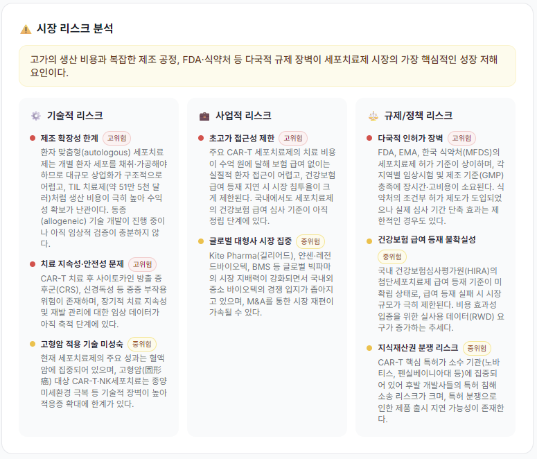
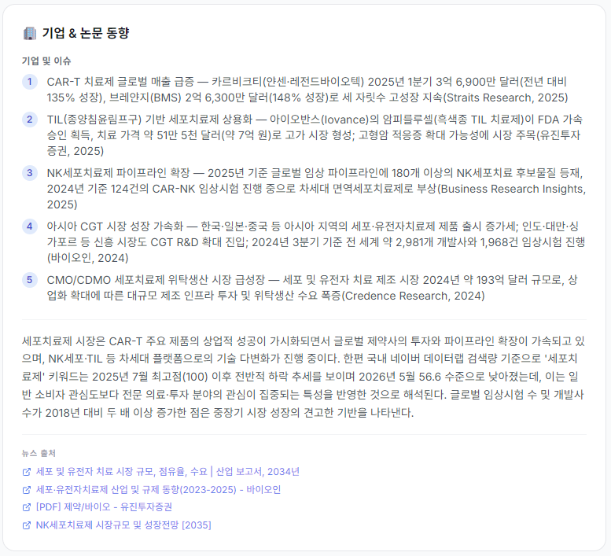
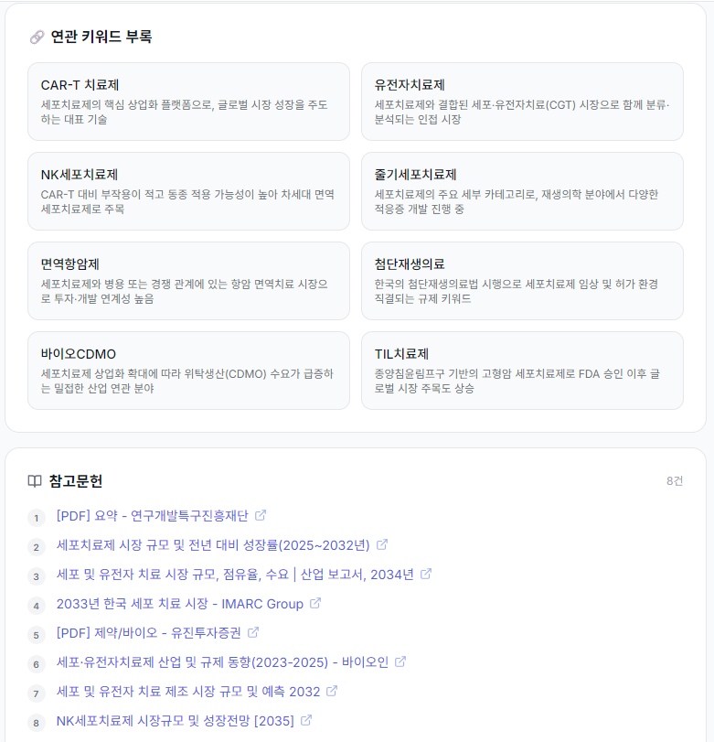

# AI 시장조사 리포트

키워드 하나로 뉴스·논문·트렌드를 자동 수집하고, Claude AI가 전문 시장 분석 리포트를 생성하는 웹 애플리케이션입니다.

🔗 **[라이브 데모 보기](https://market-research-neon.vercel.app/)**

---

## 📸 스크린샷

### 메인 화면


### 분석 진행 화면


### 리포트 결과









---

## ✨ 주요 기능

- **키워드 기반 자동 분석** — 키워드 입력 한 번으로 리포트 자동 생성
- **3개 소스 병렬 수집** — 뉴스/기업 동향(Tavily), 학술 논문(Semantic Scholar), 국내 검색 트렌드(네이버 데이터랩)를 동시에 수집
- **Claude AI 분석** — 시장 규모, 성장률, 성장 동인, 기업 동향, 리스크를 체계적으로 분석
- **시각화 차트** — 시장 규모 추이, TAM/SAM/SOM, 기업 점유율, 키워드 검색량 차트 제공
- **7일 캐시** — 동일 키워드는 Supabase에 캐싱하여 빠르게 재조회
- **Notion 내보내기** — 생성된 리포트를 Notion 페이지로 바로 저장
- **비밀번호 보호** — 미들웨어 기반 접근 제어

---

## 🛠 기술 스택

| 분류 | 기술 |
|---|---|
| 프레임워크 | Next.js 14 (App Router) |
| 언어 | TypeScript |
| 스타일 | Tailwind CSS |
| AI 분석 | Anthropic Claude (claude-sonnet-4-6) |
| 데이터 수집 | Tavily API, Semantic Scholar API, 네이버 데이터랩 API |
| 데이터베이스 | Supabase |
| 차트 | Recharts |
| 배포 | Vercel (Edge Runtime) |

---

## 📁 프로젝트 구조

```
market_research/
├── app/
│   ├── api/
│   │   ├── analyze/       # 핵심 분석 API (SSE 스트리밍)
│   │   ├── report/[id]/   # 리포트 조회 API
│   │   ├── auth/          # 인증 API
│   │   ├── notion/        # Notion 내보내기 API
│   │   ├── identify-topic/
│   │   └── cache/
│   ├── report/[id]/       # 리포트 결과 페이지
│   ├── login/             # 로그인 페이지
│   └── page.tsx           # 메인 검색 페이지
├── components/            # UI 컴포넌트
├── lib/
│   ├── claude.ts          # Claude AI 분석
│   ├── tavily.ts          # 뉴스 수집
│   ├── semantic-scholar.ts # 논문 수집
│   ├── naver-datalab.ts   # 네이버 트렌드 수집
│   ├── supabase.ts        # DB 캐시
│   ├── notion.ts          # Notion 연동
│   └── types.ts           # 공통 타입 정의
└── middleware.ts           # 인증 미들웨어
```

---

## 🔄 분석 흐름

```
키워드 입력
    ↓
캐시 확인 (Supabase, 7일)
    ↓ (캐시 없으면)
병렬 데이터 수집
├── Tavily       → 뉴스·기업 동향
├── Semantic Scholar → 학술 논문
└── 네이버 데이터랩  → 국내 검색량
    ↓
Claude AI 분석 (시장규모·성장률·리스크 등)
    ↓
Supabase 저장
    ↓
리포트 페이지 이동
```

---

## ⚙️ 로컬 실행

### 1. 환경변수 설정

`.env.local` 파일 생성 후 아래 값 입력:

```env
ANTHROPIC_API_KEY=sk-ant-...
TAVILY_API_KEY=tvly-...
NAVER_CLIENT_ID=...
NAVER_CLIENT_SECRET=...
NEXT_PUBLIC_SUPABASE_URL=https://...supabase.co
SUPABASE_SERVICE_KEY=...
NOTION_TOKEN=...           # Notion 내보내기 사용 시
NOTION_DATABASE_ID=...     # Notion 내보내기 사용 시
APP_PASSWORD=원하는비밀번호
```

### 2. 패키지 설치 및 실행

```bash
npm install
npm run dev
```

`http://localhost:3000` 에서 확인

---

## 📊 리포트 구성

생성된 리포트는 아래 섹션으로 구성됩니다:

- **시장 규모** — 글로벌/국내 TAM·SAM·SOM 추정
- **성장률** — CAGR 및 성장 카테고리 분류 (초고성장/고성장/안정성장/저성장)
- **성장 동인** — PEST 분석 및 소비자 요인
- **기업·트렌드** — 최신 뉴스 기반 기업 동향 및 학술 논문
- **시장 리스크** — 기술·비즈니스·규제 리스크 레벨 분류
- **연관 키워드** — 추가 탐색을 위한 관련 키워드 8개
- **차트** — 시장 규모 추이, 세그먼트, 점유율, 네이버 검색 트렌드

---

## 📝 라이선스

Private Project
